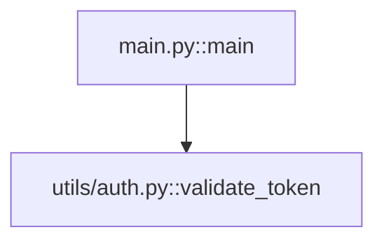

# 🗺️ Project Graph Mapper (PGM)

> Công cụ phân tích dependency và impact đa ngôn ngữ cho các dự án phần mềm.

PGM quét source code, xây dựng graph quan hệ giữa các symbol (function, class, method, struct, ...) và cho phép bạn truy vấn **impact** khi thay đổi bất kỳ symbol nào — hỗ trợ tốt cho code review, refactoring, và tích hợp với AI.

---

## 📋 Mục lục

- [Cài đặt](#-cài-đặt)
- [Ngôn ngữ hỗ trợ](#-ngôn-ngữ-hỗ-trợ)
- [Hướng dẫn sử dụng](#-hướng-dẫn-sử-dụng)
  - [Quét project (`scan`)](#quét-project-scan)
  - [Phân tích impact (`impact`)](#phân-tích-impact-impact)
  - [Tìm hotspot (`hotspots`)](#tìm-hotspot-hotspots)
  - [Phát hiện circular dependency (`cycles`)](#phát-hiện-circular-dependency-cycles)
  - [Xem ngôn ngữ hỗ trợ (`langs`)](#xem-ngôn-ngữ-hỗ-trợ-langs)
  - [Watch mode (`watch`)](#watch-mode-watch)
- [AI Parser](#-ai-parser)
- [Output](#-output)
- [Cấu trúc dự án](#-cấu-trúc-dự-án)

---

## 🚀 Cài đặt

### Yêu cầu

- Python >= 3.12
- [uv](https://docs.astral.sh/uv/) (khuyến nghị) hoặc pip

### Cài đặt cơ bản

```bash
# Clone repository
git clone <repo-url>
cd project-graph-mapper

# Cài đặt với uv
uv sync

# Hoặc với pip
pip install -e .
```

### Cài đặt với AI parser (tuỳ chọn)

```bash
# Cài thêm Anthropic SDK cho AI parser
uv sync --all-extras

# Hoặc với pip
pip install -e ".[ai]"
```

### Kiểm tra cài đặt

```bash
pgm --version
# Output: pgm, version 0.2.0
```

---

## 🌐 Ngôn ngữ hỗ trợ

| Ngôn ngữ    | Extensions              | Engine      | Ghi chú                             |
|-------------|-------------------------|-------------|--------------------------------------|
| Python      | `.py`                   | ast         | Dùng stdlib ast, hỗ trợ docstring & signature   |
| JavaScript  | `.js` `.mjs` `.cjs`     | tree-sitter | ES modules + CommonJS require, trích xuất docstring |
| TypeScript  | `.ts`                   | tree-sitter | interface, enum, type alias, docstring, tsconfig paths/alias resolution |
| TSX/JSX     | `.tsx` `.jsx`            | tree-sitter | React components, docstring, tsconfig paths/alias resolution |
| Go          | `.go`                   | tree-sitter | struct, interface, method w/ receiver, trích xuất docstring |
| Rust        | `.rs`                   | tree-sitter | impl block, trait, enum, trích xuất docstring |
| Java        | `.java`                 | tree-sitter | class, interface, enum, constructor, trích xuất docstring |
| Bất kỳ      | tuỳ chỉnh (`--ai-ext`)  | AI (opt-in) | Dùng Anthropic API                   |

---

## 📖 Hướng dẫn sử dụng

### Quét project (`scan`)

Lệnh chính — quét toàn bộ project và sinh output.

```bash
# Quét project hiện tại
pgm scan .

# Quét project tại đường dẫn cụ thể
pgm scan ./my-project

# Chỉ định thư mục output (mặc định: .pgm)
pgm scan ./my-project -o ./output
```

**Ví dụ output:**

```
Xong! 42 files · 318 symbols · 127 edges

  Language breakdown
┌────────────┬───────┬─────────┐
│ Language   │ Files │ Symbols │
├────────────┼───────┼─────────┤
│ Typescript │ 20    │ 156     │
│ Python     │ 12    │ 89      │
│ Go         │ 7     │ 54      │
│ Javascript │ 3     │ 19      │
└────────────┴───────┴─────────┘

Output → D:\my-project\.pgm
  CONTEXT.md  — paste vào AI để dùng ngay
  graph.json  — dùng cho IDE/plugin
```

PGM tự động phát hiện tất cả ngôn ngữ được hỗ trợ trong project. Không cần cấu hình gì thêm.

---

### Phân tích impact (`impact`)

Trả lời câu hỏi: **"Nếu tôi sửa function này, những file nào bị ảnh hưởng?"**

```bash
# Phân tích impact của một symbol
pgm impact validate_token --project ./my-project

# Lưu report ra file markdown
pgm impact validate_token --project ./my-project --save
```

**Ví dụ output:**

```
┌─────────────────────────────────────────────────────┐
│           Direct callers of `validate_token()`      │
├──────────────────┬──────┬───────────────────────────┤
│ File             │ Line │ Context                   │
├──────────────────┼──────┼───────────────────────────┤
│ services/user.py │ 4    │ if not validate_token(t…  │
│ api/orders.py    │ 4    │ validate_token(token)     │
└──────────────────┴──────┴───────────────────────────┘

Impact score: 2 file(s)
Location: utils/auth.py:2

Checklist:
  • Sửa code trong `utils/auth.py:2`
  • Kiểm tra `services/user.py:4` → `if not validate_token(token):`
  • Kiểm tra `api/orders.py:4` → `validate_token(token)`
```

Khi `--save` được dùng, report sẽ lưu tại `.pgm/impact_<tên_symbol>.md`.

**Trường hợp nhiều symbol cùng tên:**

Nếu có nhiều symbol trùng tên (ví dụ `findById` trong cả Java và TypeScript), PGM sẽ liệt kê tất cả để bạn chọn:

```
Có 2 symbol tên 'findById':
  src/UserService.java::UserService.findById  (UserService.java:14)
  frontend/service.ts::UserService.findById   (service.ts:10)
```

---

### Tìm hotspot (`hotspots`)

Tìm những symbol có nhiều nơi phụ thuộc nhất — đây là những chỗ **dễ gây breaking change nhất** khi sửa.

```bash
# Top 10 hotspot (mặc định)
pgm hotspots --project ./my-project

# Top 20 hotspot
pgm hotspots --project ./my-project --top 20
```

**Ví dụ output:**

```
┌──────────────────────────────────────────────────────────┐
│               Top 10 hotspot symbols                     │
├───┬─────────────────┬──────────┬──────────────┬──────────┤
│ # │ Symbol          │ Kind     │ File         │ Callers  │
├───┼─────────────────┼──────────┼──────────────┼──────────┤
│ 1 │ validate_token  │ function │ utils/auth.py│ 5        │
│ 2 │ handleRequest   │ method   │ server.go    │ 3        │
│ 3 │ fetchUser       │ function │ api.ts       │ 2        │
└───┴─────────────────┴──────────┴──────────────┴──────────┘
```

---

### Phát hiện circular dependency (`cycles`)

Tìm các vòng lặp import trong project.

```bash
pgm cycles --project ./my-project
```

**Output nếu có cycle:**

```
Tìm thấy 2 cycle(s):
  1. auth.py::validate → user.py::get_user → auth.py::validate
  2. server.go::Start → handler.go::Handle → server.go::Start
```

**Output nếu không có:**

```
Không có circular dependency ✓
```

---

### Xem ngôn ngữ hỗ trợ (`langs`)

Liệt kê tất cả ngôn ngữ và engine đang được hỗ trợ.

```bash
pgm langs
```

**Output:**

```
┌─────────────┬──────────────────────┬─────────────┐
│ Language     │ Extensions           │ Engine      │
├─────────────┼──────────────────────┼─────────────┤
│ Python       │ .py                  │ ast         │
│ Javascript   │ .js .mjs .cjs        │ tree-sitter │
│ Typescript   │ .ts                  │ tree-sitter │
│ Tsx          │ .tsx .jsx            │ tree-sitter │
│ Go           │ .go                  │ tree-sitter │
│ Rust         │ .rs                  │ tree-sitter │
│ Java         │ .java               │ tree-sitter │
│ Any          │ (dùng --ai-ext)      │ AI (opt-in) │
└─────────────┴──────────────────────┴─────────────┘
```

---

### Watch mode (`watch`)

Theo dõi thay đổi file, tự động cập nhật graph đồng thời khởi chạy Live-Reload HTTP server để phục vụ file HTML.

```bash
# Watch project hiện tại và khởi chạy local HTTP server
pgm watch --project ./my-project

# Watch với AI parser
pgm watch --project ./my-project --ai --ai-ext .vue
```

Khi chạy, PGM sẽ khởi chạy Live-Reload HTTP server trên một cổng ngẫu nhiên (ví dụ: `http://localhost:5000/graph.html`) và bắt đầu theo dõi tệp tin. Khi bạn thay đổi code:
1. Tự động re-parse file đó (incremental).
2. Cập nhật `graph.json`, `graph.html`, `graph.mermaid` và `CONTEXT.md`.
3. Server gửi tín hiệu reload qua SSE (Server-Sent Events) để cập nhật trình duyệt lập tức nếu đang mở.

```
Watching D:\my-project  (Ctrl+C để dừng)
Live-Reload Server started at: http://localhost:5000/graph.html
Changed: auth.py
Graph updated
```

---

### 🎨 Hiển thị đồ thị tương tác (`viz`)

Lệnh `viz` quét project, tạo các file đồ thị tương tác (HTML, JSON, Mermaid) và khởi chạy Live-Reload HTTP Server kết hợp Watch Mode, tự động mở trình duyệt hiển thị đồ thị tại địa chỉ `http://localhost:<port>/graph.html`.

```bash
# Khởi chạy server, watch project và mở trình duyệt tự động
pgm viz ./my-project

# Chỉ tạo file graph.html, không khởi chạy server hay mở trình duyệt
pgm viz ./my-project --no-open

# Kết hợp AI parser
pgm viz ./my-project --ai --ai-ext .vue
```

**Các tính năng trên giao diện Web D3.js nâng cao:**
- **Live-Reload tự động**: Khi bạn sửa code trong IDE, trang web sẽ tự động reload ngay lập tức để hiển thị đồ thị cập nhật mà không cần tải lại thủ công.
- **2 Chế độ xem (Modes)**:
  - **Xem File**: Thể hiện cấu trúc tệp tin và mối quan hệ import/phụ thuộc.
  - **Xem Symbol**: Thể hiện các Class, Function, Method, Struct và mối quan hệ gọi hàm cụ thể.
- **Trực quan hóa Hotspots**: Các symbol có `impact_score` cao (nhiều nơi gọi nhất) sẽ có kích thước node lớn hơn và có hiệu ứng viền nhấp nháy (pulsing glow) màu cam neon để dễ nhận biết.
- **Highlight chu trình (Cycles)**: Danh sách các chu trình circular dependency được hiển thị trên thanh điều khiển trái. Khi click vào một chu trình, các cạnh và node tạo nên chu trình đó sẽ chuyển sang màu đỏ neon nổi bật.
- **Đoạn mã Context (Code Preview)**: Khi click vào một Symbol, panel thông tin chi tiết bên phải ngoài signature và docstring còn hiển thị trực tiếp đoạn code thực tế (15 dòng đầu tiên nơi khai báo symbol) với định dạng font chữ monospace chuyên nghiệp.

---

### 🚀 Tìm đường đi cuộc gọi (`path`)

Tìm tất cả các đường đi (call paths) kết nối cuộc gọi từ một Symbol bắt đầu đến một Symbol kết thúc. Rất hữu ích để debug hoặc lần theo luồng code phức tạp.

```bash
pgm path start_func end_func --project ./my-project
```

**Ví dụ output:**
```
Tìm thấy 2 đường đi:

Path #1:
  start_func (app.py:10)
   -> helper_func (utils.py:15)
     -> end_func (db.py:20)

Path #2:
  start_func (app.py:10)
   -> direct_call (db.py:25)
     -> end_func (db.py:20)
```

---

### 💀 Tìm code thừa (`deadcode`)

Phát hiện các hàm, lớp, phương thức không được gọi/sử dụng ở bất cứ đâu trong dự án (ngoại trừ các file test).

```bash
pgm deadcode --project ./my-project
```

**Ví dụ output:**
```
Tìm thấy 2 symbol có thể không được sử dụng
┌─────────────────┬──────────┬──────────────┬──────┐
│ Symbol          │ Kind     │ File         │ Line │
├─────────────────┼──────────┼──────────────┼──────┤
│ unused_helper   │ function │ utils.py     │ 42   │
│ OldController   │ class    │ controller.py│ 10   │
└─────────────────┴──────────┴──────────────┴──────┘
```

---

## 🤖 AI Parser


AI Parser dùng Anthropic API (Claude) để phân tích các file mà tree-sitter chưa hỗ trợ, ví dụ: `.vue`, `.svelte`, `.rb`, `.php`, `.swift`, `.kt`, ...

### Thiết lập

```bash
# 1. Cài thêm Anthropic SDK
uv sync --all-extras
# hoặc: pip install -e ".[ai]"

# 2. Đặt API key
# Windows (PowerShell):
$env:ANTHROPIC_API_KEY = "sk-ant-..."

# Linux/macOS:
export ANTHROPIC_API_KEY="sk-ant-..."
```

### Sử dụng

```bash
# Dùng AI cho một số extensions cụ thể
pgm scan ./my-project --ai --ai-ext .vue --ai-ext .svelte

# Dùng AI cho TẤT CẢ file (chi phí cao hơn, nhưng hiểu ngữ nghĩa tốt hơn)
pgm scan ./my-project --ai-all

# Chỉ định model (mặc định: claude-sonnet-4-20250514)
pgm scan ./my-project --ai --ai-ext .vue --ai-model claude-sonnet-4-20250514
```

### Cache

AI Parser tự động cache kết quả tại `.pgm/ai_cache.json`:
- Key cache: `(đường_dẫn_file, hash_nội_dung)`
- Nếu file không đổi → dùng cache, **không gọi API lại**
- Xoá file `ai_cache.json` để force re-parse

### Lưu ý quan trọng

| Nên dùng AI khi                                       | Không nên dùng khi                        |
|-------------------------------------------------------|-------------------------------------------|
| File extension chưa có tree-sitter (`.vue`, `.rb`...) | Project lớn (1000+ file) — tốn token      |
| Muốn hiểu ngữ nghĩa sâu hơn (pattern, docstring)     | CI/CD pipeline — phụ thuộc network         |
| Project nhỏ, không ngại chi phí API                   | File chứa code nhạy cảm / bí mật          |

**Chi phí ước tính:**
- File ~100 dòng ≈ 500 tokens input + 200 tokens output ≈ $0.0007/file
- Nhờ cache, mỗi file chỉ gọi API **1 lần** dù scan nhiều lần

---

## 📁 Output

Sau khi chạy `pgm scan` hoặc `pgm viz`, thư mục `.pgm/` sẽ chứa các tệp đầu ra:

### `graph.mermaid`

Tệp mô tả đồ thị bằng ngôn ngữ Mermaid để bạn dễ dàng render hoặc nhúng trực tiếp vào tài liệu markdown:


### `CONTEXT.md`

File markdown tổng quan project — **paste trực tiếp vào AI** (ChatGPT, Claude, ...) để AI hiểu cấu trúc code:

```markdown
# Project Context Snapshot

> Generated: 2026-06-03 15:00  |  Files: 42  |  Symbols: 318

## Language breakdown
| Language   | Files | Symbols | Engine      |
|------------|-------|---------|-------------|
| Typescript | 20    | 156     | tree-sitter |
| Python     | 12    | 89      | ast         |
| Go         | 7     | 54      | tree-sitter |

## Entry points
- `src/main.py` (3 symbols)
- `cmd/server.go` (2 symbols)

## Hotspot symbols (top 10 by impact)
...

## File overview
...
```

### `graph.json`

Dữ liệu graph ở dạng JSON — dùng cho IDE plugin, visualization tool, hoặc script tự viết:

```json
{
  "generated": "2026-06-03T15:00:00",
  "stats": { "total_files": 42, "total_symbols": 318 },
  "files": {
    "utils/auth.py": {
      "path": "utils/auth.py",
      "imports": ["jwt"],
      "symbols": ["utils/auth.py::validate_token"],
      "language": "python"
    }
  },
  "symbols": { ... }
}
```

### `graph.html`

Trang HTML chứa đồ thị trực quan hóa tương tác (D3.js). Trang này tự kết nối với Local Server qua SSE để tự động tải lại khi phát hiện thay đổi.

### `impact_<name>.md`

Report impact cho symbol cụ thể (khi dùng `--save`).

---

## 🏗️ Cấu trúc dự án

```
src/project_graph_mapper/
├── __init__.py
├── cli.py                      # CLI commands (scan, impact, hotspots, path, deadcode, viz, ...)
├── watcher.py                  # Watch mode — theo dõi thay đổi file, cập nhật đồ thị và kích hoạt reload
├── server.py                   # Live-Reload HTTP server đa luồng tích hợp cổng SSE
├── parser/
│   ├── __init__.py
│   ├── base.py                 # BaseParser ABC + Registry
│   ├── tree_sitter_base.py     # TreeSitterParser — base class chung trích xuất docstrings
│   ├── python_parser.py        # PythonParser (dùng stdlib ast)
│   ├── js_parser.py            # JavaScript / TypeScript / TSX với tsconfig alias resolution
│   ├── go_parser.py            # GoParser
│   ├── rust_parser.py          # RustParser
│   ├── java_parser.py          # JavaParser
│   └── ai_parser.py            # AiParser (Anthropic API)
├── graph/
│   ├── models.py               # SymbolKind, Symbol, FileNode, CallSite
│   ├── builder.py              # GraphBuilder — xây dựng dependency graph
│   └── query.py                # QueryEngine — impact, hotspots, cycles, paths, deadcode
└── output/
    ├── md_writer.py             # Sinh CONTEXT.md, impact report và graph.mermaid
    ├── json_writer.py           # Sinh graph.json
    └── html_writer.py           # Sinh graph.html trực quan hóa D3.js
```

---

## 📌 Các thư mục tự động bỏ qua

PGM tự động bỏ qua các thư mục sau khi quét:

`.venv` · `venv` · `__pycache__` · `.git` · `.pgm` · `node_modules` · `.tox` · `dist` · `build`

---

## 🔧 Phát triển

```bash
# Cài dev dependencies
uv sync --group dev

# Chạy tests
uv run pytest tests/ -v

# Lint
uv run ruff check src/
```

---

## 📄 License

MIT
